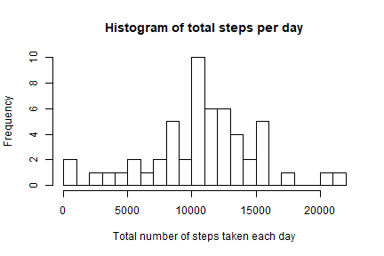
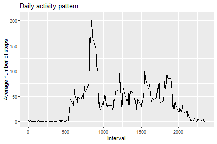
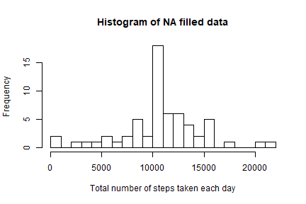
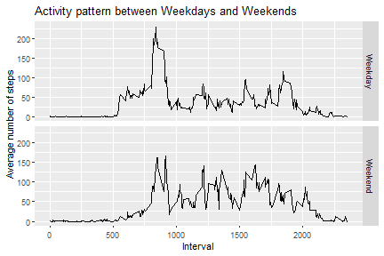

# Course Project 1


## Loading and preprocessing the data
### Download dataset as dataframe

```r
library(readr)
url <- "https://d396qusza40orc.cloudfront.net/repdata%2Fdata%2Factivity.zip"
download.file(url,destfile="activity.csv.zip")
df <- read_csv("activity.csv.zip")
```

```
## Parsed with column specification:
## cols(
##   steps = col_double(),
##   date = col_date(format = ""),
##   interval = col_double()
## )
```

## What is mean total number of steps per day
### Calculate the total number of steps per day 

```r
library(dplyr)
y <- df %>% group_by(date) %>% summarise(total=sum(steps))
head(y) 
```

```
## # A tibble: 6 x 2
##   date       total
##   <date>     <dbl>
## 1 2012-10-01    NA
## 2 2012-10-02   126
## 3 2012-10-03 11352
## 4 2012-10-04 12116
## 5 2012-10-05 13294
## 6 2012-10-06 15420
```
and make a histogram.

```r
hist(y$total,xlab="Total number of steps taken each day",main="Histogram of total steps per day", breaks=25) 
```



### The mean of the total number of steps taken per day

```r
 mean(y$total, na.rm=T)
```

```
## [1] 10766.19
```

### The median of the total number of steps taken per day

```r
median(y$total, na.rm=T) 
```

```
## [1] 10765
```

## What is the average daily activity pattern? 
Make a time series plot of the 5-minute interval (x-axis) and the average number of steps taken, averaged across all days (y-axis)

```r
library(ggplot2)
library(dplyr)
dt <- df %>% group_by(interval) %>% summarise(avesteps = mean(steps,na.rm=T)) 
        ggplot(dt,aes(interval,avesteps)) + geom_line() + 
        ggtitle("Daily activity pattern") + xlab("Interval") + ylab("Average number of steps")
```



Which 5-minute interval, on average across all the days in the dataset, contains the maximum number of steps?

```r
dt$interval[which.max(dt$avesteps)]
```

```
## [1] 835
```

## Imputing missing values 

### Total number of missing values in the data set

```r
 na <- subset(df,is.na(df$steps))
 nrow(na)
```

```
## [1] 2304
```

### Filling in all of the missing values in the dataset.
### Creat new dataset(df2) filled the NAs with mean for that 5 min-interval

```r
 df2 <- df 
 head(df2)
```

```
## # A tibble: 6 x 3
##   steps date       interval
##   <dbl> <date>        <dbl>
## 1    NA 2012-10-01        0
## 2    NA 2012-10-01        5
## 3    NA 2012-10-01       10
## 4    NA 2012-10-01       15
## 5    NA 2012-10-01       20
## 6    NA 2012-10-01       25
```

```r
 int <- df2$interval[is.na(df2$steps)]
 df2$steps[is.na(df2$steps)] <- dt$avesteps[dt$interval %in% int]
 head(df2)
```

```
## # A tibble: 6 x 3
##    steps date       interval
##    <dbl> <date>        <dbl>
## 1 1.72   2012-10-01        0
## 2 0.340  2012-10-01        5
## 3 0.132  2012-10-01       10
## 4 0.151  2012-10-01       15
## 5 0.0755 2012-10-01       20
## 6 2.09   2012-10-01       25
```

### Make a histogram of the total number of steps taken each day in new data set.

```r
 z <- with(df2,tapply(steps,date,sum)) 
 hist(z, xlab="Total number of steps taken each day",main="Histogram of NA filled data", breaks=25) 
```



### Calculate mean of total steps per day in new data set. 

```r
mean(z, na.rm=T)
```

```
## [1] 10766.19
```

### Calculate median of total steps per day in new data set.

```r
median(z, na.rm=T)
```

```
## [1] 10766.19
```

## Are there differences in activity patterns between Weekdays and Weekends? 
### Creat a new factor variable - "weekday" and "weekend" 

```r
df2$weekdays <- weekdays(df2$date) 
df2$weekdays <- ifelse(df2$weekdays=="토요일"|df2$weekdays=="일요일","Weekend","Weekday")
head(df2)
```

```
## # A tibble: 6 x 4
##    steps date       interval weekdays
##    <dbl> <date>        <dbl> <chr>   
## 1 1.72   2012-10-01        0 Weekday 
## 2 0.340  2012-10-01        5 Weekday 
## 3 0.132  2012-10-01       10 Weekday 
## 4 0.151  2012-10-01       15 Weekday 
## 5 0.0755 2012-10-01       20 Weekday 
## 6 2.09   2012-10-01       25 Weekday
```

### Make a panel plot 
containing a time series of the 5 miniute interval (x-axis) and the average number of steps, averaged all weekdays or weekend days(y-axis)

```r
dt2 <- df2 %>% group_by(interval,weekdays) %>% summarise(avesteps = mean(steps)) 
        ggplot(dt2,aes(interval,avesteps,group=weekdays)) + geom_line() + facet_grid(weekdays~.) + 
        ggtitle("Activity pattern between Weekdays and Weekends") + xlab("Interval") + ylab("Average number of steps")
```


